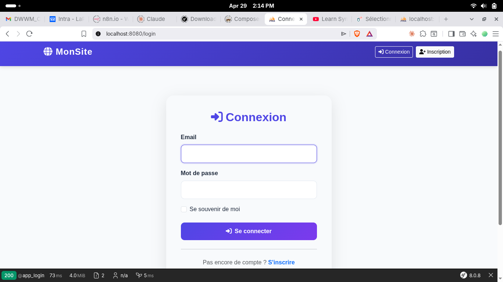
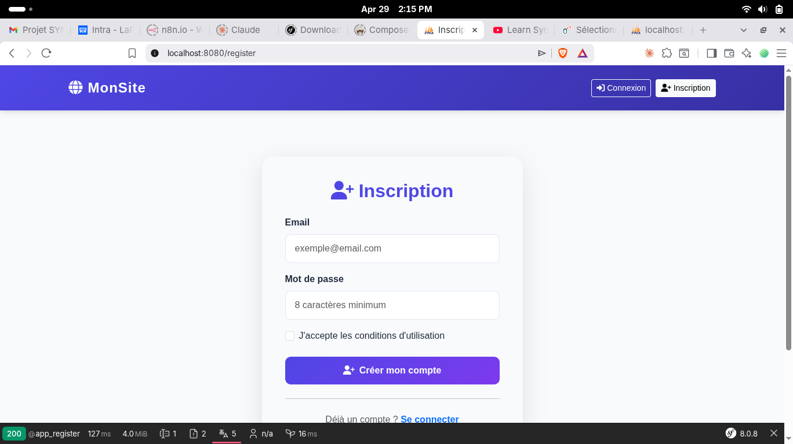
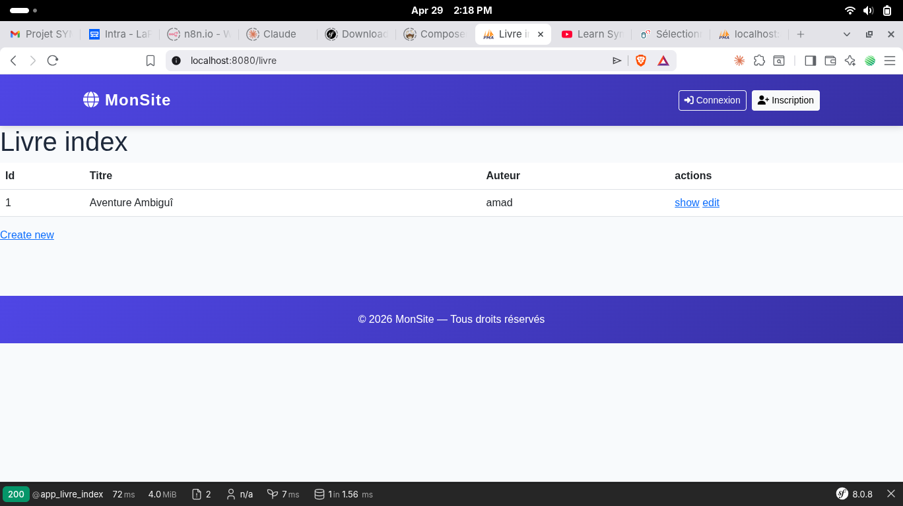
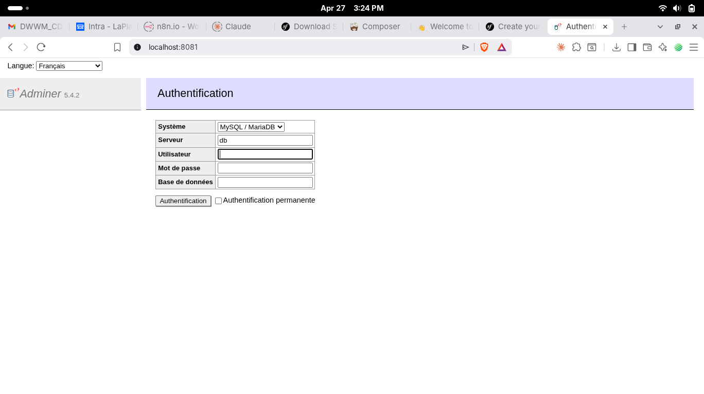
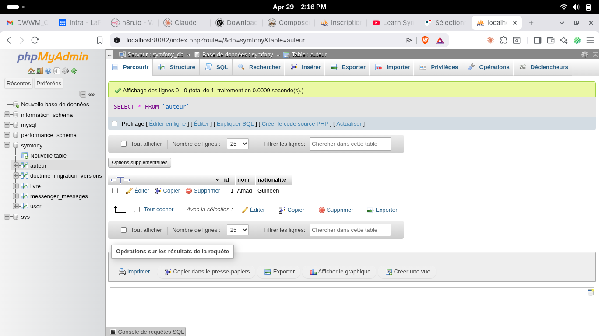
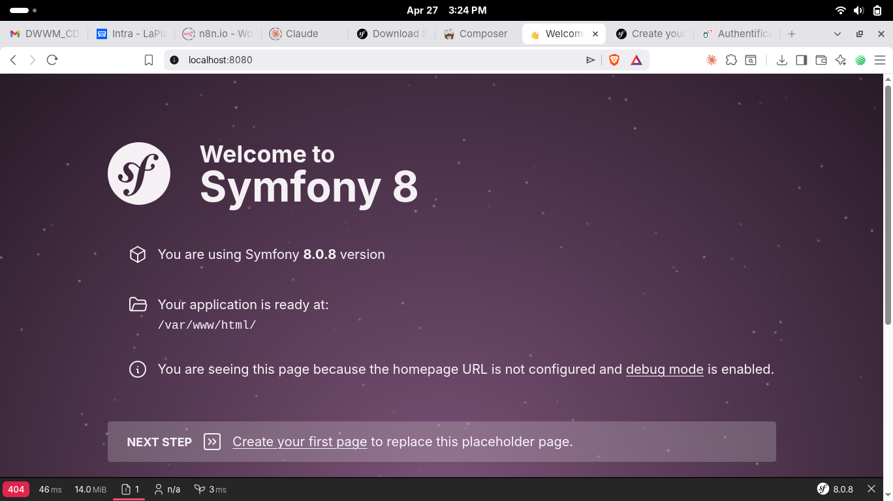

# Documentation de l'environnement Docker Symfony

---

## Dockerfile

```dockerfile
FROM php:8.2-fpm
```
Utilise l'image officielle PHP 8.2 avec PHP-FPM comme base du conteneur.

```dockerfile
RUN apt-get update && apt-get install -y curl unzip git
```
Met à jour la liste des paquets, puis installe `curl`, `unzip`, et `git`.

```dockerfile
RUN curl -sS https://getcomposer.org/installer | php \
```
Télécharge l'installateur officiel de Composer en mode silencieux (`-sS`) et l'exécute avec PHP.

```dockerfile
&& mv composer.phar /usr/local/bin/composer
```
Déplace l'exécutable Composer dans `/usr/local/bin/` pour le rendre accessible globalement via la commande `composer`.

---

## default.conf (Nginx)

```nginx
server {
```
Ouvre un bloc de configuration pour un serveur virtuel Nginx.

```nginx
    listen 80;
```
Le serveur écoute les connexions HTTP sur le port 80.

```nginx
    server_name localhost;
```
Ce bloc répond aux requêtes adressées à `localhost`.

```nginx
    root /var/www/html/public;
```
Définit le répertoire racine du site web — le dossier `public/` de Symfony.

```nginx
    index index.php index.html;
```
Nginx cherche d'abord `index.php`, puis `index.html` comme fichier d'entrée par défaut.

```nginx
    location / {
        try_files $uri /index.php$is_args$args;
    }
```
Pour toute requête, Nginx tente de servir le fichier demandé ; si introuvable, il redirige vers `index.php` (le front controller de Symfony) en conservant les paramètres de la requête.

```nginx
    location ~ \.php$ {
```
Ce bloc s'applique à toutes les requêtes dont l'URL se termine par `.php`.

```nginx
        include fastcgi_params;
```
Inclut les paramètres FastCGI standards définis par Nginx.

```nginx
        fastcgi_pass app:9000;
```
Transmet les requêtes PHP au conteneur `app` (PHP-FPM) sur le port 9000.

```nginx
        fastcgi_index index.php;
```
Définit `index.php` comme fichier par défaut pour les requêtes FastCGI.

```nginx
        fastcgi_param SCRIPT_FILENAME $document_root$fastcgi_script_name;
```
Indique à PHP-FPM le chemin absolu du fichier PHP à exécuter.

```nginx
    location ~ /\.ht {
        deny all;
    }
```
Interdit l'accès à tous les fichiers commençant par `.ht` (ex : `.htaccess`) pour des raisons de sécurité.

```nginx
}
```
Ferme le bloc `server`.

---

## docker-compose.yml

```yaml
services:
```
Déclare la liste de tous les conteneurs (services) qui composent l'application.

### Service `app`

```yaml
  app:
    image: php:8.2-fpm
```
Utilise l'image PHP 8.2 FPM pour le conteneur de l'application.

```yaml
    container_name: symfony_app
```
Donne le nom `symfony_app` au conteneur pour l'identifier facilement.

```yaml
    working_dir: /var/www/html
```
Définit le répertoire de travail par défaut à l'intérieur du conteneur.

```yaml
    volumes:
      - ./app:/var/www/html
```
Monte le dossier local `./app` dans le conteneur — les modifications sont synchronisées en temps réel.

```yaml
      - app_logs:/var/log/php
```
Stocke les logs PHP dans un volume nommé persistant.

```yaml
      - app_cache:/var/www/html/var
```
Stocke le cache et les sessions Symfony dans un volume nommé persistant.

```yaml
    networks:
      - symfony_network
```
Connecte ce service au réseau interne `symfony_network` pour communiquer avec les autres conteneurs.

---

### Service `webserver`

```yaml
  webserver:
    image: nginx:stable
```
Utilise l'image Nginx stable comme serveur web.

```yaml
    container_name: symfony_webserver
```
Nomme le conteneur `symfony_webserver`.

```yaml
    ports:
      - "8080:80"
```
Expose le port 80 du conteneur sur le port 8080 de la machine hôte — accès via `http://localhost:8080`.

```yaml
    volumes:
      - ./app:/var/www/html
```
Partage le code source avec Nginx pour qu'il puisse servir les fichiers statiques.

```yaml
      - ./nginx:/etc/nginx/conf.d
```
Monte la configuration Nginx locale (`default.conf`) dans le conteneur.

```yaml
      - nginx_logs:/var/log/nginx
```
Stocke les logs Nginx dans un volume nommé persistant.

```yaml
    depends_on:
      - app
```
Attend que le conteneur `app` soit démarré avant de lancer Nginx.

---

### Service `database`

```yaml
  database:
    image: mysql:8.0
```
Utilise l'image MySQL 8.0 comme base de données.

```yaml
    container_name: symfony_db
```
Nomme le conteneur `symfony_db`.

```yaml
    environment:
      MYSQL_ROOT_PASSWORD: root
```
Définit le mot de passe du super-utilisateur `root` de MySQL.

```yaml
      MYSQL_DATABASE: symfony
```
Crée automatiquement une base de données nommée `symfony` au démarrage.

```yaml
      MYSQL_USER: symfony
      MYSQL_PASSWORD: symfony
```
Crée un utilisateur `symfony` avec le mot de passe `symfony`, ayant accès à la base `symfony`.

```yaml
    ports:
      - "3306:3306"
```
Expose le port MySQL sur la machine hôte pour accès depuis un client externe (ex : DBeaver, TablePlus).

```yaml
    volumes:
      - db_data:/var/lib/mysql
```
Stocke les données MySQL dans un volume persistant — elles survivent aux redémarrages des conteneurs.

---

### Service `adminer`

```yaml
  adminer:
    image: adminer
```
Utilise l'image Adminer, un outil web léger de gestion de base de données.

```yaml
    container_name: symfony_adminer
    restart: always
```
Redémarre automatiquement le conteneur s'il s'arrête.

```yaml
    ports:
      - "8081:8080"
```
Accès à Adminer via `http://localhost:8081`.

```yaml
    depends_on:
      - database
```
Attend que le conteneur `database` soit démarré avant de lancer Adminer.

---

### Service `phpmyadmin`

```yaml
  phpmyadmin:
    image: phpmyadmin/phpmyadmin
```
Utilise l'image officielle phpMyAdmin, interface web de gestion MySQL.

```yaml
    container_name: symfony_phpmyadmin
    restart: always
```
Redémarre automatiquement le conteneur s'il s'arrête.

```yaml
    ports:
      - "8082:80"
```
Accès à phpMyAdmin via `http://localhost:8082`.

```yaml
    environment:
      PMA_HOST: symfony_db
```
Indique à phpMyAdmin l'adresse du serveur MySQL (nom du conteneur).

```yaml
      MYSQL_ROOT_PASSWORD: root
```
Mot de passe root transmis à phpMyAdmin pour l'authentification.

```yaml
      PMA_PMADB: phpmyadmin
```
Nom de la base de données interne utilisée par phpMyAdmin pour stocker sa configuration.

```yaml
      PMA_CONTROLUSER: symfony
      PMA_CONTROLPASS: symfony
```
Utilisateur et mot de passe utilisés par phpMyAdmin pour gérer ses tables internes.

```yaml
    volumes:
      - phpmyadmin_data:/var/lib/phpmyadmin
```
Persiste les données internes de phpMyAdmin entre les redémarrages.

---

### Networks

```yaml
networks:
  symfony_network:
    driver: bridge
```
Crée un réseau virtuel de type `bridge` qui isole les conteneurs du projet et leur permet de se parler par nom (ex : `app`, `symfony_db`).

---

### Volumes

```yaml
volumes:
  db_data:
  phpmyadmin_data:
  app_logs:
  app_cache:
  nginx_logs:
```
Déclare tous les volumes nommés utilisés par les services. Docker les gère et les persiste indépendamment du cycle de vie des conteneurs.

---

## Annexes — Captures d'écran

Les captures d'écran sont stockées dans le dossier [`screenshot/`](./screenshot/).

### Page d'accueil


### Page de connexion


### Page d'inscription


### Page administrateur


### Page utilisateur


### Page liste des livres


### Adminer — Base de données


### phpMyAdmin — Base de données


### Welcome Symfony

